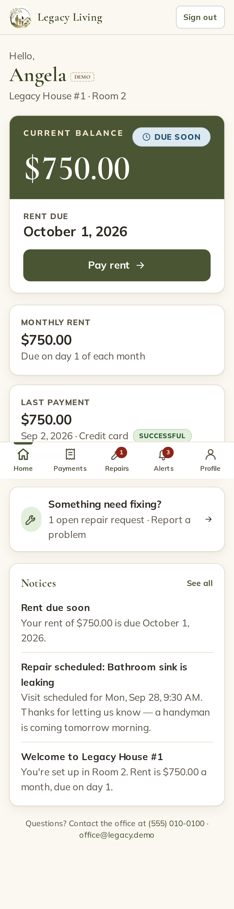
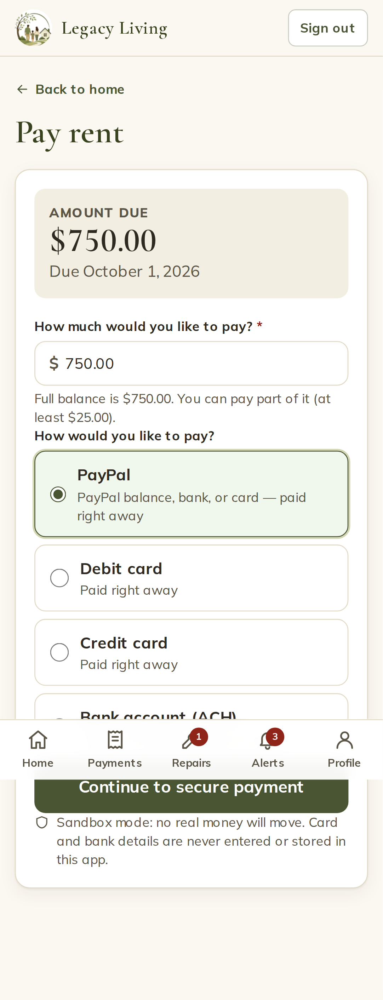
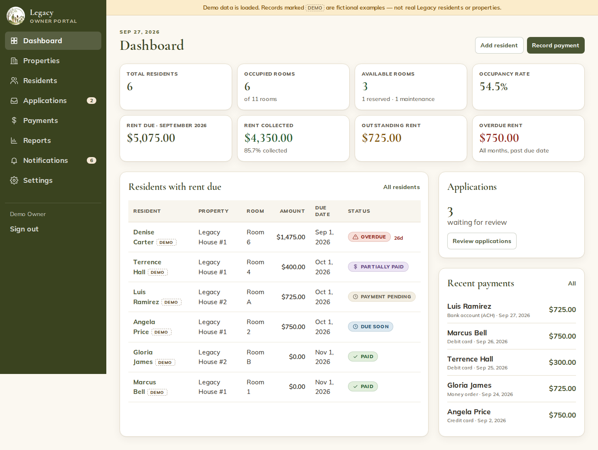

# Legacy Independent Living — Resident & Owner Portal

An installable PWA that runs Legacy Independent Living day to day:
**applicant → review → approval → room assignment → resident account → rent charges → payment → receipt → owner dashboard.**

- **Residents** (mobile-first, big type, big buttons): current balance, due date, one **Pay rent** button, payment history with receipts, documents, notices.
- **Repairs**: residents report a problem (type, urgency, photos, OK-to-enter), follow its status, get notified when it's scheduled, message the office, cancel or reopen. The owner gets a prioritized maintenance queue with scheduling, assignee, resident-visible and staff-only notes.
- **Owner/Admin**: occupancy + rent-collection dashboard, properties → rooms → residents, application pipeline, payments (online + cash/money order), auditable ledgers, reports, announcements, settings, audit log.

> Branding (olive/forest palette, Cormorant Garamond + Mulish, tree-and-family mark) comes from
> [legacyindependentliving.net](https://legacyindependentliving.net). The marketing site lives on `main`
> of this repo; the portal lives on the `portal-app` branch so none of it is published by GitHub Pages.

<p>
  
  
  
</p>

More in [`docs/screenshots`](docs/screenshots) (regenerated by CI on commits tagged `[screenshots]`).

---

## Quick start

Requirements: **Node 22.18+**, **PostgreSQL 14+** (`psql` on your PATH for the DB tests).

```bash
cp .env.example .env                 # set DATABASE_URL (and APP_URL if not localhost:3000)
npm install
npx prisma migrate deploy            # creates the schema, including integrity rules
npm run db:seed                      # DEMO data (clearly flagged) — skip in production
npm run dev                          # http://localhost:3000
```

Demo logins (seed only):

| Role | Email | Password |
|---|---|---|
| Owner | `owner@legacy.demo` | `LegacyDemo2026!` |
| Resident (due soon) | `angela.price@legacy.demo` | `ResidentDemo2026!` |
| Resident (paid) | `marcus.bell@legacy.demo` | same |
| Resident (partial) | `terrence.hall@legacy.demo` | same |
| Resident (overdue + late fee) | `denise.carter@legacy.demo` | same |
| Resident (ACH pending) | `luis.ramirez@legacy.demo` | same |

The seed is date-relative, so every rent status is always on screen. All demo records carry a **DEMO** tag and
the admin shows a banner while demo data exists. Names and addresses are fictional.

### Walk the success scenario (≈2 minutes)
1. Open `/apply` in a private window and submit an application (or use demo applicant **Jordan Ellis**, already approved).
2. Sign in as the owner → **Applications** → open the applicant → set **Approved** → **Convert to resident**:
   *Legacy House #1 · Room 3, $750, move-in Oct 1, due day 1*.
3. Copy the setup link → open it → set a password. The resident dashboard shows **$750.00 · Due October 1, 2026 · Due soon**.
4. **Pay rent** → sandbox checkout → **Pay $750.00** → receipt. Balance **$0.00 · Paid**.
5. Owner dashboard shows the resident as **Paid**; Room 3 stays assigned to them; October's report shows the collection.

Use `APP_TODAY=2026-09-27 npm run dev` to pin the business date for demos.

---

## Verify

```bash
npm run verify            # typecheck + lint + unit + database + integration tests
npm run test:e2e          # Playwright: success scenario, authorization, mobile layout, PWA
```

| Suite | What it proves | Runs against |
|---|---|---|
| `tests/unit` (52) | money parsing (no floats), date math & timezone, FIFO ledger allocation, rent charge planning (mid-month move-in, day-31 clamping, end dates), status derivation (Paid / Due soon / Due / Overdue / Partial / Pending), late fees, collection math (spec's 88.9% example), payment state machine, partial-payment rules, RBAC, scrypt hashing, tokens, rate limiter, Stripe signature verification + event mapping + HTTP adapter | pure TS |
| `tests/db` (31) | ledger is append-only (UPDATE/DELETE blocked), sign rules, one-ledger-entry-per-payment, idempotent rent keys, payment immutability + legal transitions, one resident per room / one room per resident, one active rent schedule, no hard deletes of residents/history, audit log append-only, settings singleton, **schema.prisma ↔ database drift** | real PostgreSQL |
| `tests/integration` | the whole business flow through the service layer: apply → approve → convert → invite → pay → $0; declined card; ACH pending → cleared; refund; money order; overpayment/min-partial rules; engine idempotency; late fees; reminders once; transfer; rent change; move-out reversal | real PostgreSQL + Prisma |
| `tests/e2e` | the spec's success scenario in a browser, resident can't reach admin or another resident's receipt, no horizontal scroll on phone + desktop, manifest/SW served, cron auth | production build |

CI (`.github/workflows/portal-ci.yml`) runs all of it on every push to `portal-app` with a Postgres 16 service:
typecheck → lint → unit → DB integrity → integration → production build → seed → Playwright (phone + desktop). All green.

---

## Architecture (short)

```
src/
  domain/       Pure business rules — money, dates, ledger, rent engine, payments, permissions. No I/O.
  server/       Services: transactional, audited, authorization-agnostic (take an Actor). Prisma only here.
  lib/          Infrastructure: db, auth/session, validation (zod), payments providers, notify, storage, security.
  app/          Next.js App Router: pages (RSC) + server actions (authorize → validate → service → revalidate).
  components/   UI kit (forms keep input on error, accessible field errors, status badges, occupancy board).
prisma/         schema.prisma + hand-written SQL migration (adds CHECKs, partial indexes, append-only triggers) + demo seed.
```

Full details — schema, routes, auth model, payment architecture, rent engine, security — in
[`docs/ARCHITECTURE.md`](docs/ARCHITECTURE.md). Deployment runbook: [`docs/DEPLOYMENT.md`](docs/DEPLOYMENT.md).

### Money & ledger rules
- Currency is **integer cents** end to end; user input is parsed from strings (never floats).
- Balance is **always** `SUM(ledger_entries.amount_cents)` — there is no balance column.
- Ledger rows are **append-only** (database trigger). Corrections are new `ADJUSTMENT`/`CREDIT` rows.
- Statuses are **derived** from the ledger (FIFO allocation) + in-flight ACH — never typed in by hand.
- Rent charges are generated with idempotency keys (`rent:<resident>:<YYYY-MM>`), so the engine can run any number of times.

### Payments
- Provider interface (`src/lib/payments/provider.ts`) with three implementations:
  **Stripe** (production — debit/credit card, Cash App Pay, bank account/ACH via hosted Checkout; server-side confirmation on return), **PayPal** (alternative), **Mock** (sandbox checkout inside the app; refused in production).
- Card and bank details are entered on the processor's hosted page. The database stores only opaque references, brand and last 4 (a CHECK constraint rejects anything that isn't 4 digits).
- A payment only hits the ledger on **SUCCEEDED**; pending ACH shows as *Payment pending*; refunds post a `REFUND` entry.
- Webhooks are signature-verified (raw body, 5-min tolerance, constant-time compare) and de-duplicated by event id.

### Security
- How payments, accounts and the app are protected, and how each is tested: [`docs/SECURITY.md`](docs/SECURITY.md).

### Push notifications
- Web Push (browsers + Home-Screen PWA on iOS 16.4+) and Apple Push (native iOS app in `native/`), implemented without dependencies and verified against the RFC 8291 test vector.
- Sent within a second of the event; `/api/cron/notify` is the backstop. Details: `docs/ARCHITECTURE.md` §7, setup: `docs/DEPLOYMENT.md` §9.

### iOS app
- `native/` is a Capacitor 7 shell around the live portal. Build steps for Claude Code in VS Code: `native/CLAUDE.md`. Launch checklist: `docs/MVP_READINESS.md`.

---

## Scripts

| Command | Purpose |
|---|---|
| `npm run dev` / `build` / `start` | Next.js |
| `npm run db:migrate` | apply migrations (`prisma migrate deploy`) |
| `npm run db:seed` | demo data (only on an empty database) |
| `npm run db:check` | assert `schema.prisma` matches the live database |
| `npm run rent:run` | post due rent + late fees + send reminders (also `POST /api/cron/rent`) |
| `npm run icons` | regenerate PWA icons from `public/brand/logo-mark.png` |
| `npm run push:keys` | generate Web Push (VAPID) keys |
| `npm run review:account` | create/reset the App Store review login (`REVIEW_PASSWORD`) in a test home excluded from totals |
| `npm run owner:create` | create the first owner account (`OWNER_EMAIL`, `OWNER_NAME`, `OWNER_PASSWORD`) |

## Adding the portal to the website
Link the site's **Apply** buttons to `https://<portal-domain>/apply` and add a **Resident login** link to `https://<portal-domain>/login`.
